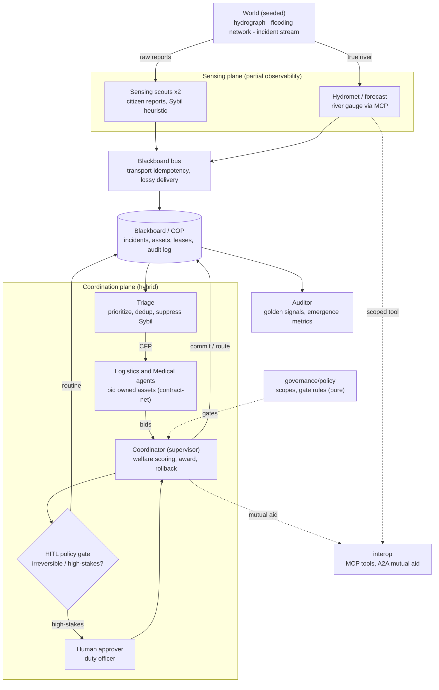

# bayanihan-net — a multi-agent disaster-response system

*A small but credible multi-agent system that coordinates scarce rescue assets during a
typhoon-induced flood in the Marikina River basin, Metro Manila — with a real coordination
mechanism, a real safety story, and honest failure analysis.*

> **Bayanihan** (Filipino): a community lifting a house together — the spirit of collective
> mutual aid in a crisis. It is the organizing metaphor for this system: many specialized,
> partially-informed agents self-organizing to reduce harm under scarcity.

This is the capstone for *Designing & Building Agentic AI Systems* (McGill MMA). It is graded
on the working repository, not slides — so the emphasis here is **behaviour over polish**:
every claim below is produced by code you can run, from a seed, with no API key.

---

## TL;DR — what it does and what we found

A seeded discrete-event simulation drives a typhoon flood up the Marikina hydrograph. Six
flood-exposed barangays generate rescue / medical / relief incidents faster than nine scarce
assets (boats, trucks, medical teams) can serve them. A **hybrid** multi-agent system runs the
response: a **blackboard** Common Operating Picture, a **contract-net auction** for scarce
assets scored on *global social welfare*, and a **command-center supervisor** with a
**human-in-the-loop** gate for irreversible actions. An offline **reinforcement-learning**
study tackles the routing sub-problem and demonstrates reward hacking.

Headline, reproducible findings (12 paired seeds; see [docs/EVALUATION_PLAN.md](docs/EVALUATION_PLAN.md)):

- **Coordination beats no-coordination — that is the result the data supports.** The hybrid
  *significantly* outserves a random allocator (severity-weighted service **+0.0125 ★**, raw served
  **+0.0136 ★**): triage and welfare scoring earn their keep over acting at random. Against the other
  *reasonable* policies — greedy-nearest, FIFO, fairness-ordering — the differences are within noise.
  Under hard saturation the binding constraint is physical reachability and capacity, not the
  allocation rule, so we claim no significant separation where the data shows none.

- **Governance is nearly free at baseline and essential under stress.** Removing the HITL gate
  changes baseline service by ~0.2 pp; meanwhile **all six red-team stress scenarios (and the
  baseline) re-stabilize with zero safety-invariant violations** (no double-commit, graceful degradation).

- **A naive fairness lever doesn't help — and we report it.** Re-ordering the queue toward
  under-served barangays is *directionally* worse on worst-served coverage but within noise, because
  reachability and capacity, not scheduling order, are the binding constraints. We keep this
  evaluated negative rather than quietly dropping it.

- **Reward hacking is real and learnable.** A risk-aware routing reward beats a naive
  travel-time reward on the *true* objective (2.71 vs 2.53) and the learned policy even beats
  the hand-coded heuristic (2.36) — while taking less flood exposure.

The system is deliberately **capacity-saturated** (assets ≪ need), which is the realistic
disaster regime and the reason effect sizes are modest but consistent. We treat that as a
finding, not a bug.

---

## Architecture



Each tick: the world advances → forecast/scouts refresh the COP → triage prioritizes →
contract-net auction → coordinator awards (through the HITL gate) → assets move along
risk-aware routes, validated against the *true* flood at arrival → auditor samples metrics.
The control plane is pure, deterministic Python; only the world is stochastic (one seed).

---

## The eight "must-cover" items → where they live

| Item | Where |
|---|---|
| **Why MAS** (single agent insufficient) | [docs/DESIGN.md §1](docs/DESIGN.md) |
| **Emergence** (named, good + bad, with metrics) | [docs/DESIGN.md §5](docs/DESIGN.md), [`governance/metrics.py`](src/bayanihan_net/governance/metrics.py) |
| **Communication** (schema, routing, escalation, shared state) | [docs/COMMUNICATION_CONTRACT.md](docs/COMMUNICATION_CONTRACT.md), [`messages.py`](src/bayanihan_net/messages.py), [`blackboard.py`](src/bayanihan_net/blackboard.py) |
| **Coordination** (mechanism, defended) | [docs/DESIGN.md §3](docs/DESIGN.md), [`coordination/`](src/bayanihan_net/coordination/) |
| **Incentives** (local vs global) | [docs/DESIGN.md §4](docs/DESIGN.md), [`coordination/contract_net.py`](src/bayanihan_net/coordination/contract_net.py) |
| **Interoperability** (A2A / MCP) | [docs/DESIGN.md §6](docs/DESIGN.md), [`interop/`](src/bayanihan_net/interop/) |
| **Operations** (observability, evaluation, rollback, HITL) | [docs/EVALUATION_PLAN.md](docs/EVALUATION_PLAN.md), [docs/SAFETY_GOVERNANCE.md](docs/SAFETY_GOVERNANCE.md) |
| **MARL bridge** (is it appropriate? a real study) | [docs/MARL_BRIDGE.md](docs/MARL_BRIDGE.md), [`rl/`](src/bayanihan_net/rl/) |

---

## Quickstart

Python 3.12. The whole core runs with no API key and no network. We use [`uv`](https://docs.astral.sh/uv/),
mirroring the prior assignments.

```bash
cd bayanihan-net
uv venv --python 3.12
uv pip install -r requirements-core.txt
uv pip install -e . --no-deps

# 1) quality gates — behaviour/invariant tests, lint, format, types
uv run pytest -q                      # 55 tests, all green (98% coverage)
uv run ruff check src/ tests/ evals/  # lint: E/F/I/UP/B/SIM, all clean
uv run ruff format --check src/ tests/ evals/   # consistent formatting, all clean
uv run mypy src/bayanihan_net         # strict types (disallow_untyped_defs), clean

# 2) the worked scenario → evidence/ + figures/
uv run python -m bayanihan_net.cli run

# 3) hybrid vs. baselines across 12 paired seeds → results.csv + eval_report.json
uv run python -m bayanihan_net.cli eval

# 4) red-team stress battery → stress_report.json (exit 1 on any safety violation)
uv run python -m bayanihan_net.cli stress

# 5) offline MARL routing study (pure numpy; no torch) → rl_training.json + curve
uv run python -m bayanihan_net.cli rl-train

# 6) Tier-A invariant gate (CI-style, hard exit code)
uv run python evals/run_evals.py
```

The optional `requirements-stretch.txt` (gymnasium / torch / stable-baselines3) is **not
required** — the shipped RL study is tabular numpy so it is fully reproducible with core deps.
The stretch stack is the path to function approximation, documented in MARL_BRIDGE.

---

## What you get (evidence)

Running the CLI writes provenance-stamped artifacts (every file carries seed + library
versions + an env fingerprint):

```text
evidence/
  run_log.txt            # human-readable transcript: one incident end-to-end + summary
  audit_log.jsonl        # the immutable event spine (incl. MCP/A2A hops)
  decision_package.json  # a real HITL decision package (context, options, recommendation, risk)
  scenario_report.json   # full provenance + outcome + emergence + golden signals
  results.csv            # one row per (policy, seed)
  eval_report.json       # per-policy means ± SE and paired hybrid-vs-baseline deltas
  stress_report.json     # per-scenario re-stabilization + safety checks
  rl_training.json       # naive vs risk-aware vs heuristic, with training curve
figures/
  response_timeline.png  coverage_by_barangay.png  policy_comparison.png
  stress_response.png    rl_training_curve.png
```

---

## Reproducibility & traceability

**Clean-clone reproducible.** From a fresh checkout (no `.venv`, no caches), the quickstart rebuild
regenerates **byte-identical** numbers — the evaluation grid, golden signals, and paired deltas all
match the committed `evidence/`, and even the `env_fingerprint` matches (the in-range library
versions resolve identically). Determinism is also **process-independent**: two runs under different
`PYTHONHASHSEED` produce identical evidence.

**Every artifact is self-describing.** Each file under `evidence/` carries a `provenance` block —
seed(s), Python version, platform, exact library versions, and a short `env_fingerprint` — so any
number can be tied to the environment that produced it.

**Every headline number traces to one command + one field:**

| Claim | Command | Artifact → field |
|---|---|---|
| served / SLA / coverage of the worked run | `cli run` | `scenario_report.json → evaluation.system_level` |
| hybrid +0.0125 ★ sev-wt served vs random (paired) | `cli eval` | `eval_report.json → hybrid_minus_baseline_paired` |
| per-policy means ± SE | `cli eval` | `eval_report.json → per_policy`; rows in `results.csv` |
| all 7 battery scenarios re-stabilize (6 stress + baseline) | `cli stress` | `stress_report.json → scenarios.*.checks` |
| reward hacking: 2.71 vs 2.53 vs 2.36 | `cli rl-train` | `rl_training.json → final`, `verdict` |
| no double-commit, awards trace to bids | any `run` | `scenario_report.json → evaluation.interaction_level` |
| safety invariants hold (CI gate) | `evals/run_evals.py` | exit code 0 / per-check PASS lines |

**Incident-level traceability.** A single incident is followable end-to-end through the immutable
`audit_log.jsonl` by its `incident_id` (e.g. `T:rescue:2`: `incident_opened → asset_committed →
awarded → asset_on_scene`); the serving asset's later return to the pool is logged as `asset_freed`
(keyed by `asset_id`). The matching messages share `trace_id = trace:<incident_id>`, and
`run_log.txt` renders one such lifecycle automatically.

> Usability note: after `uv pip install -e .` the console script works too — `bayanihan-net run`,
> `bayanihan-net eval`, etc. (equivalent to `python -m bayanihan_net.cli …`). `bayanihan-net --help`
> lists all subcommands. The paper PDF and the end-to-end slide deck (`slides/slides.pdf`) are both
> committed, so no LaTeX toolchain is needed to read them — the deck is the fastest way to see the
> problem framing, methodology, and implementation in one pass.

---

## Repository tour

Listed in **reading order** — which is also strict **dependency order**: the import graph is a
verified acyclic DAG (0 cycles across 36 modules), layered `config → messages/network → incidents
→ blackboard/scenario → agents → coordinator → engine → baselines → cli`. Each module opens with a
docstring stating the problem it solves and why it exists; no function exceeds cyclomatic
complexity 10. So you can read top-to-bottom and every file only depends on ones above it.

```text
src/bayanihan_net/
  config.py            frozen dataclasses · global SEED · the Marikina scenario
  messages.py          the communication contract (Pydantic envelope + typed payloads)
  network.py           flood-aware road graph + risk-aware routing
  incidents.py         incident model · severity/priority · content-key dedup
  scenario.py          the seeded world: hydrograph, flooding, citizen-report stream
  blackboard.py        the COP: idempotency · leases/freshness · atomic no-double-commit
  agents/              sensing · forecast · triage · logistics · medical · routing · coordinator · auditor
  coordination/        blackboard_bus · contract_net (welfare scoring) · escalation (HITL + rollback)
  governance/          policy (scopes + HITL gate, pure) · metrics (golden signals + Gini/entropy)
  interop/             mcp_tools (scoped, policy-gated) · a2a (cross-agency mutual aid)
  rl/                  routing_env · marl (tabular Q-learning) · evaluate (reward-hacking study)
  engine.py            the discrete-event orchestrator
  provenance.py        shared seed/version/fingerprint stamping for every artifact
  baselines.py         ablation policies + paired comparison + stress battery
  plotting.py          figures
  cli.py               run / eval / stress / rl-train
evals/                 scenarios.jsonl · run_evals.py (Tier-A gate)
tests/                 55 behaviour/invariant tests (98% coverage)
docs/                  SYSTEM_BRIEF · DESIGN · COMMUNICATION_CONTRACT · EVALUATION_PLAN ·
                       SAFETY_GOVERNANCE · MARL_BRIDGE · COURSE_ALIGNMENT · REFLECTION
paper/                 report.tex + committed report.pdf (self-contained write-up)
slides/                slides.tex + committed slides.pdf (end-to-end deck for review)
AGENTS.md              the agent-roster contract
```

---

## Grading-rubric coverage map

| Category (pts) | Where |
|---|---|
| Use-case quality & stakeholder framing (4) | [SYSTEM_BRIEF.md](docs/SYSTEM_BRIEF.md), README intro |
| Agent role design & boundaries (5) | [AGENTS.md](AGENTS.md), `agents/*`, `governance/policy.py` |
| Communication protocol & architecture (5) | [COMMUNICATION_CONTRACT.md](docs/COMMUNICATION_CONTRACT.md), `messages.py`, Mermaid diagram |
| Coordination & incentive design (6) | [DESIGN.md §3–4](docs/DESIGN.md), `coordination/contract_net.py` |
| Prototype / simulation / worked scenario (5) | `engine.py`, `cli.py run`, `evidence/run_log.txt`, figures |
| Evaluation, observability & safety (6) | [EVALUATION_PLAN.md](docs/EVALUATION_PLAN.md), [SAFETY_GOVERNANCE.md](docs/SAFETY_GOVERNANCE.md), stress battery |
| Presentation & clarity (4) | this README, consistent docs, `paper/report.tex` |

---

## Honesty notes (expanded in [REFLECTION.md](docs/REFLECTION.md))

- **Illustrative, not authoritative.** Marikina alarm thresholds, barangay populations, the
  road network, and the fleet are plausible stand-ins, *not* official PAGASA / MMDA / LGU
  figures. A real deployment sources live feeds (the `interop/` boundary is where).

- **Mocked external boundaries.** PAGASA / MMDA / hospital feeds and cross-agency A2A are mocked
  adapters with realistic schemas; the *boundary and the policy gate are real in code*.

- **RL is offline and advisory only** — never in the live safety loop; the deterministic
  heuristic is always the authority.

- **Modest, honest effect sizes.** Under severe capacity saturation the policy gaps are small
  but consistent and, where claimed significant, are paired-significant across 12 seeds.
